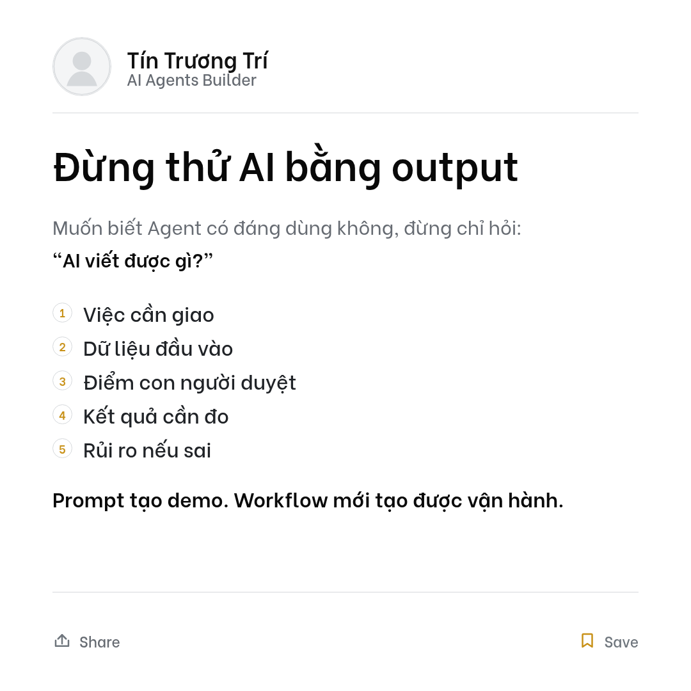

# LinkedIn Decision Content Skill

Reusable OpenClaw skill package for creating LinkedIn posts that help readers make a stuck decision, plus a consistent single-image PNG template.

## What This Skill Produces

- LinkedIn caption draft.
- Single-image PNG content structure.
- Rendered `1080x1080` PNG through HTML/CSS.
- Optional LinkedIn draft handoff when connectors are available.

Core formula:

```text
Decision trap -> Hidden bias/cost -> Reframe -> Checklist/workflow -> Closing line
```

PNG structure:

```text
Title cụ thể
Context ngắn
3-6 actionable bullets
Closing rõ lực
```

## Complete Example

Example caption:

```text
Nhiều doanh nghiệp tưởng mình đang thử AI Agent.

Thật ra họ chỉ đang thử output.

Một prompt hay có thể tạo ra một bài viết, một email, một bản tóm tắt. Nhưng nó chưa chứng minh rằng Agent có thể vận hành được trong business.

Câu hỏi đúng không phải là:
"AI viết được gì?"

Câu hỏi đúng hơn là:
"Phần nào trong workflow có thể được giao cho Agent với input, điểm duyệt, tiêu chuẩn kết quả và ranh giới rủi ro rõ ràng?"

Trước khi thử một Agent, hãy kiểm tra 5 điểm:

1. Việc này có lặp lại đủ nhiều không?
2. Input đầu vào có rõ không?
3. Output tốt/xấu được đánh giá bằng tiêu chí nào?
4. Chỗ nào bắt buộc con người duyệt?
5. Nếu Agent làm sai, rủi ro nằm ở đâu?

Prompt tạo demo.
Workflow mới tạo được vận hành.
```

Example single-image PNG:



Source notes for this example live in:

```text
examples/decision-content-ai-agent-workflow.md
```

## End-User Requirements

Minimum intake:

- Name to show on the card.
- LinkedIn headline or positioning line.
- Square avatar image.
- Niche / positioning.
- Target reader.
- Topic or raw note.
- Point of view.
- CTA preference.
- Claims or words to avoid.

Better results require:

- Real cases, examples, or screenshots.
- 3-5 recurring customer/reader pains.
- 3 posts the user likes and 3 posts the user dislikes.
- Offer, lead magnet, or audit CTA if the post should drive inbound.

## Required Assets

Replace the placeholder avatar:

```text
skills/linkedin-decision-content/assets/brand/avatar-square.svg
```

Recommended assets per user:

```text
assets/brand/avatar-square.png
assets/brand/avatar-original.png
assets/brand/logo.png                 # optional
assets/brand/brand.json               # optional colors/headline
```

Avatar guidance:

- Use a square crop.
- Face should be clear.
- Prefer real photo over initials or placeholder.
- Keep the original image available for future crops.

## Environment

No secret environment variables are required for the skill itself.

Local rendering needs:

- `chromium` or compatible Chrome binary.
- Shell access to run `scripts/render-linkedin-single-image.sh`.
- Write permission for the output folder.

Optional environment or setup:

- `CHROME_BIN=/path/to/chrome` if Chromium is not named `chromium`.

## Optional OpenClaw Setup

Connectors:

- LinkedIn connector: create drafts or publish after approval.
- Google Drive connector: persist image and obtain connector-accessible storage when LinkedIn tools cannot use local paths.

Channels:

- Telegram, Zalo, Slack, Discord, or WhatsApp channel for preview and approval.

Scheduled Tasks:

- Use for recurring idea mining, weekly draft batches, or reminder-to-review flows.
- Do not schedule public LinkedIn publishing unless the user explicitly asks for that operating model.

## Render Example

From the repo root:

```bash
./skills/linkedin-decision-content/scripts/render-linkedin-single-image.sh \
  ./skills/linkedin-decision-content/templates/linkedin-single-image \
  /tmp/linkedin-post.png
```

To customize, edit:

```text
skills/linkedin-decision-content/templates/linkedin-single-image/linkedin-data.js
```

Then render again.

## Publishing Safety

Default states:

- `For Review`: angle, research notes, questions.
- `For Approval`: caption + PNG structure or rendered preview.
- `Ready To Publish`: final caption, final image, connector handoff notes.

Only publish after explicit approval such as:

```text
duyệt đăng bài này
OK đăng
publish bản này
```

Creating a private LinkedIn draft still touches an external account; ask before doing it unless the user's request clearly includes draft creation.

## Do Not Commit

- LinkedIn access tokens.
- Google Drive credentials.
- Real customer data.
- Private user memory.
- Unapproved personal photos from a customer.
- Rendered output containing private content unless intentionally used as an example.
